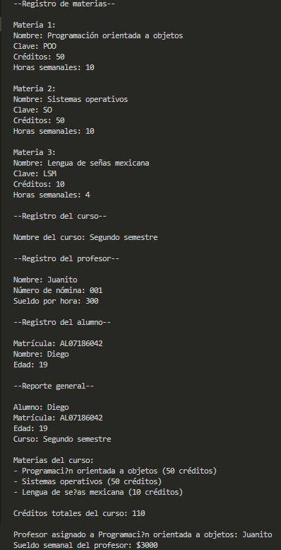

# Actividad 4
[Volver al inicio]()
## Descripción de la actividad
Este es un sistema de gestión escolar, que permite al usuario gestionar materias, cursos, profesores y alumnos.
## Código
``` java
package actividad4;
import java.util.Scanner;

public class Actividad4 {
    public static void main(String[] args) {
        Scanner sc = new Scanner(System.in);

        System.out.println("--Registro de materias--");
        Subject[] subjects = new Subject[3];
        for (int i = 0; i < 3; i++) {
            System.out.println("\nMateria " + (i + 1) + ":");
            System.out.print("Nombre: ");
            String subjectName = sc.nextLine();
            System.out.print("Clave: ");
            String subjectID = sc.nextLine();
            System.out.print("Créditos: ");
            int creditsNumber = Integer.parseInt(sc.nextLine());
            System.out.print("Horas semanales: ");
            int weeklyHours = Integer.parseInt(sc.nextLine());
            subjects[i] = new Subject(subjectName, subjectID, creditsNumber, weeklyHours);
        }

        System.out.println("\n--Registro del curso--");
        System.out.print("\nNombre del curso: ");
        String courseName = sc.nextLine();
        Course course = new Course(courseName, subjects[0], subjects[1], subjects[2]);

        System.out.println("\n--Registro del profesor--");
        System.out.print("\nNombre: ");
        String teacherName = sc.nextLine();
        System.out.print("Número de nómina: ");
        String payrollNumber = sc.nextLine();
        System.out.print("Sueldo por hora: ");
        int wagePerHour = Integer.parseInt(sc.nextLine());
        Teacher teacher = new Teacher(teacherName, payrollNumber, wagePerHour);
        subjects[0].setTeacher(teacher);
        teacher.setAssignedSubject(subjects[0]);

        System.out.println("\n--Registro del alumno--");
        System.out.print("\nMatrícula: ");
        String studentID = sc.nextLine();
        System.out.print("Nombre: ");
        String studentName = sc.nextLine();
        System.out.print("Edad: ");
        int age = Integer.parseInt(sc.nextLine());
        Student student = new Student(studentID, studentName, age);
        student.setCourse(course);

        System.out.println("\n--Reporte general--");
        System.out.println("\nAlumno: " + student.getStudentName());
        System.out.println("Matrícula: " + student.getStudentID());
        System.out.println("Edad: " + student.getAge());
        System.out.println("Curso: " + course.getCourseName());
        System.out.println("\nMaterias del curso:");
        for (Subject s : course.getSubjects()) {
            System.out.println("- " + s.getSubjectName() + " (" + s.getCreditsNumber() + " créditos)");
        }
        System.out.println("\nCréditos totales del curso: " + course.calculateTotalCredits());
        System.out.println("\nProfesor asignado a " + subjects[0].getSubjectName() + ": " + teacher.getTeacherName());
        System.out.println("Sueldo semanal del profesor: $" + teacher.calculateWage());
    }  
}

    class Course {

        private String courseName;
        private Subject[] subjects;

        public Course() {
        this.courseName = "Sin nombre";
        this.subjects = new Subject[3];
        }

        public Course(String courseName, Subject s1, Subject s2, Subject s3) {
           setCourseName(courseName);
           this.subjects = new Subject[3];
           this.subjects[0] = s1;
           this.subjects[1] = s2;
           this.subjects[2] = s3; 
        }

        public Course(Course other) {
            this.courseName = other.courseName;
            this.subjects = new Subject[3];
            for(int i = 0; i < 3; i++) {
                this.subjects[i] = other.subjects[i];
           }
        }

        public void setCourseName(String courseName) {
            if (courseName == null || courseName.trim().isEmpty()) {
                throw new IllegalArgumentException("El nombre del curso no puede estar vacío");
            }
            this.courseName = courseName;
        }

        public String getCourseName() {
            return courseName;
        }

        public Subject[] getSubjects() {
            return subjects;
        }

        public int calculateTotalCredits() {
            int totalCredits = 0;
            for (Subject s : subjects) {
                if (s != null) {
                    totalCredits += s.getCreditsNumber();
                }
            }
            return totalCredits;
        }
    } 

    class Subject {

        private String subjectName;
        private String subjectID;
        private int creditsNumber;
        private int weeklyHours;
        private Teacher teacher;

        public Subject() {
            this.subjectName = "Sin nombre";
            this.subjectID = "Sin clave de la materia";
            this.creditsNumber = 0;
            this.weeklyHours = 0;
            this.teacher = null;
        }

        public Subject(String subjectName, String subjectID, int creditsNumber, int weeklyHours) {
           setSubjectName(subjectName);
           setSubjectID(subjectID);
           setCreditsNumber(creditsNumber);
           setWeeklyHours(weeklyHours);
           this.teacher = null;
        }

        public Subject(Subject other) {
           this.subjectName = other.subjectName;
           this.subjectID = other.subjectID;
           this.creditsNumber = other.creditsNumber;
           this.weeklyHours = other.weeklyHours;
           this.teacher = null;
        }

        public void setSubjectName(String subjectName) {
            if (subjectName == null || subjectName.trim().isEmpty()) {
                throw new IllegalArgumentException("El nombre de la materia no puede estar vacio");
            }
            this.subjectName = subjectName;
        }

        public String getSubjectName() {
            return subjectName;
        }

        public void setSubjectID(String subjectID) {
            if (subjectID == null || subjectID.trim().isEmpty()) {
                throw new IllegalArgumentException("La clave de la materia no puede estar vacía");
            }
            this.subjectID = subjectID;
        }

        public String getSubjectID() {
            return subjectID;
        }

        public void setCreditsNumber(int creditsNumber) {
            if (creditsNumber < 0) {
                throw new IllegalArgumentException("Los créditos no pueden ser menores a cero");
            }
            this.creditsNumber = creditsNumber;
        }
        
        public int getCreditsNumber() {
            return creditsNumber;
        }

        public void setWeeklyHours(int weeklyHours) {
            if (weeklyHours < 0) {
                throw new IllegalArgumentException("Las horas semanales no pueden ser menores a cero");
            }
            this.weeklyHours = weeklyHours;
        }

        public int getWeeklyHours() {
            return weeklyHours;
        }

        public void setTeacher(Teacher teacher) {
            if (teacher == null) {
                throw new IllegalArgumentException("El nombre del profesor no puede estar vacío");
            }
            this.teacher = teacher;
        }
    }

    class Teacher {

        private String teacherName;
        private String payrollNumber;
        private int wagePerHour;
        private Subject assignedSubject;

        public Teacher() {
            this.teacherName = "Sin nombre";
            this.payrollNumber = "Sin número de nómina";
            this.wagePerHour = 0;
            this.assignedSubject = null;
        }

        public Teacher(String teacherName, String payrollNumber, int wagePerHour) {
            setTeacherName(teacherName);
            setPayrollNumber(payrollNumber);
            setWagePerHour(wagePerHour);
            this.assignedSubject = null;
        }

        public Teacher(Teacher other) {
            this.teacherName = other.teacherName;
            this.payrollNumber = other.payrollNumber;
            this.wagePerHour = other.wagePerHour;
            this.assignedSubject = other.assignedSubject;
        }

        public void setTeacherName(String teacherName) {
            if (teacherName == null || teacherName.trim().isEmpty()) {
                throw new IllegalArgumentException("El nombre del profesor no puede estar vacío");
            }
            this.teacherName = teacherName;
        }

        public String getTeacherName() {
            return teacherName;
        }

        public void setPayrollNumber(String payrollNumber) {
            if (payrollNumber == null || payrollNumber.trim().isEmpty()) {
                throw new IllegalArgumentException("El número de nómina no puede estar vacío");
            }
            this.payrollNumber = payrollNumber;
        }

        public void setWagePerHour(int wagePerHour) {
            if (wagePerHour < 0) {
                throw new IllegalArgumentException("El sueldo por hora no puede ser menor a cero");
            }
            this.wagePerHour = wagePerHour;
        }

        public int calculateWage() {
            if (assignedSubject == null) {
                return 0;
            }
            return assignedSubject.getWeeklyHours() * wagePerHour;
        }

        public void setAssignedSubject(Subject subject) {
            if (subject == null) {
                throw new IllegalArgumentException("La materia no puede estar vacía");
            }
            this.assignedSubject = subject;
        }
    }

    class Student {
        
        private String studentID;
        private String studentName;
        private int age;
        private Course course;

        public Student() {
            this.studentID = "Sin matrícula";
            this.studentName = "Sin nombre";
            this.age = 0;
            this.course = null;
        }

        public Student(String studentID, String studentName, int age) {
            setStudentID(studentID);
            setStudentName(studentName);
            setAge(age);
            this.course = null;
        }

        public Student(Student other) {
            this.studentID = other.studentID;
            this.studentName = other.studentName;
            this.age = other.age;
            this.course = other.course;
        }

        public void setStudentID(String studentID) {
            if (studentID == null || studentID.trim().isEmpty()) {
                throw new IllegalArgumentException("La matrícula del estudiante no puede estar vacía");
            }
            this.studentID = studentID;
        }

        public String getStudentID() {
            return studentID;
        }

        public void setStudentName(String studentName) {
            if (studentName == null || studentName.trim().isEmpty()) {
                throw new IllegalArgumentException("El nombre del estudiante no puede estar vacío");
            }
            this.studentName = studentName;
        }

        public String getStudentName() {
            return studentName;
        }

        public void setAge(int age) {
            if (age < 0) {
                throw new IllegalArgumentException("La edad del estudiante no puede estar vacía");
            }
            this.age = age;
        }

        public int getAge() {
            return age;
        }

        public void setCourse(Course course) {
            if (course == null) {
                throw new IllegalArgumentException("El curso no puede estar vacío");
            }
            this.course = course;
        }
    }

```
## Entrada y salida
