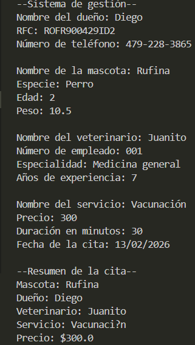

# Ejercicio 1
[Volver al inicio]()
## Descripción del ejercicio
Este es un sistema de gestión para una veterinaria, le permite al usuario gestionar a los dueños, veterinarios, mascotas, los servicios y las consultas.
## Código
``` java
package ejercicios.ejercicio1;
import java.util.Scanner;

public class Ejercicio1 {
    public static void main(String[] args) {
    Scanner sc = new Scanner(System.in);

    System.out.println("--Sistema de gestión--");

    System.out.print("Nombre del dueño: ");
    String ownerName = sc.nextLine();
    System.out.print("RFC: ");
    String rfc = sc.nextLine();
    System.out.print("Número de teléfono: ");
    String phoneNumber = sc.nextLine();
    Owner owner = new Owner(ownerName, rfc, phoneNumber);

    System.out.print("\nNombre de la mascota: ");
    String petName = sc.nextLine();
    System.out.print("Especie: ");
    String species = sc.nextLine();
    System.out.print("Edad: ");
    int age = Integer.parseInt(sc.nextLine());
    System.out.print("Peso: ");
    double weight = Double.parseDouble(sc.nextLine());
    Pet pet = new Pet(petName, species, owner, age, weight);

    System.out.print("\nNombre del veterinario: ");
    String vetName = sc.nextLine();
    System.out.print("Número de empleado: ");
    String employeeId = sc.nextLine();
    System.out.print("Especialidad: ");
    String speciality = sc.nextLine();
    System.out.print("Años de experiencia: ");
    int experienceYears = Integer.parseInt(sc.nextLine());
    Vet vet = new Vet(vetName, employeeId, speciality, experienceYears);

    System.out.print("\nNombre del servicio: ");
    String serviceName = sc.nextLine();
    System.out.print("Precio: ");
    double price = Double.parseDouble(sc.nextLine());
    System.out.print("Duración en minutos: ");
    int duration  = Integer.parseInt(sc.nextLine());
    Service service = new Service(serviceName, price, duration);

    System.out.print("Fecha de la cita: ");
    String date = sc.nextLine();

    Appointment appointment = new Appointment(date, pet, vet, service);

    System.out.println("\n--Resumen de la cita--");
    System.out.println("Mascota: " + pet.getPetName());
    System.out.println("Dueño: " + owner.getOwnerName());
    System.out.println("Veterinario: " + vet.getEmployeeName());
    System.out.println("Servicio: " + service.getServiceName());
    System.out.println("Precio: $" + appointment.getTotalPrice());

    }
}
    class Owner {

        private String ownerName;
        private String rfc;
        private String phoneNumber;

        public Owner() {
            this.ownerName = "Sin nombre";
            this.rfc = "Sin RFC";
            this.phoneNumber = "Sin número de telefono";
        }

        public Owner(String ownerName, String rfc, String phoneNumber) {
            setOwnerName(ownerName);
            setRfc(rfc);
            setPhoneNumber(phoneNumber);
        }

        public Owner(Owner other) {
            this.ownerName = other.ownerName;
            this.rfc = other.rfc;
            this.phoneNumber = other.phoneNumber;
        }

        public String getOwnerName() {
            return ownerName;
        }

        public void setOwnerName(String ownerName) {
            if (ownerName == null || ownerName.trim().isEmpty()) {
                throw new IllegalArgumentException("El nombre del dueño no puede estar vacio");
            }
            this.ownerName = ownerName;
        } 

        public String getRfc() {
            return rfc;
        }

        public void setRfc(String rfc) {
            if (rfc == null || rfc.trim().isEmpty()) {
                throw new IllegalArgumentException("El rfc no puede estar vacío");
            }
            this.rfc = rfc;
        }

        public String getPhoneNumber() {
            return phoneNumber;
        }

        public void setPhoneNumber(String phoneNumber) {
            if (phoneNumber == null || phoneNumber.trim().isEmpty()) {
                throw new IllegalArgumentException("El número de teléfono no puede estar vacío");
            }
            this.phoneNumber = phoneNumber;
        } 
    }

    class Pet {

        private String petName;
        private String species;
        private Owner owner;
        private int age;
        private double weight;

        public Pet() {
            this.petName = "Sin nombre";
            this.species = "Desonocida";
            this.owner = new Owner();
            this.age = 0;
            this.weight = 0.0;
        }

        public Pet(String petName, String species, Owner owner, int age, double weight) {
            setPetName(petName);
            setSpecies(species);
            setOwner(owner);
            setAge(age);
            setWeight(weight);
        }

        public Pet(Pet other) {
            this.petName = other.petName;
            this.species = other.species;
            this.owner = new Owner(other.owner);
            this.age = other.age;
            this.weight = other.weight;
        }

        public String getPetName() {
            return petName;
        }

        public void setPetName(String petName) {
            if (petName == null) {
                throw new IllegalArgumentException("El nombre de la mascota no puede estar vacío");
            }
            this.petName = petName;
        }

        public String getSpecies() {
            return species;
        }

        public void setSpecies(String species) {
            if (species == null || species.trim().isEmpty()) {
                throw new IllegalArgumentException("La especie no puede estar vacía");
            }
            this.species = species;
        }

        public Owner getOwner() {
            return owner;
        }

        public void setOwner(Owner owner) {
            if (owner == null) {
                throw new IllegalArgumentException("El nombre del dueño no puede estar vacío");
            }
            this.owner = owner;
        }
        
        public int getAge() {
            return age;
        }

        public void setAge(int age) {
            if (age < 0) {
                throw new IllegalArgumentException("La edad no puede ser menor a cero");
            }
            this.age = age;
        }

        public double getWeight() {
            return weight;
        }

        public void setWeight(double weight) {
            if (weight < 0) {
                throw new IllegalArgumentException("El peso no puede ser menor a cero");
            }
            this.weight = weight;
        }
    }

    class Vet {

        private String employeeName;
        private String employeeID;
        private String speciality;
        private int experienceYears;

        public Vet() {
            this.employeeName = "Sin nombre";
            this.employeeID = "Sin número de empleado";
            this.speciality = "sin especialidad";
            this.experienceYears = 0;
        }

        public Vet(String employeeName, String employeeID, String speciality, int experienceYears) {
            this.employeeName = employeeName;
            this.employeeID = employeeID;
            this.speciality = speciality;
            this.experienceYears = experienceYears;
        }

        public Vet(Vet other) {
            this.employeeName = other.employeeName;
            this.employeeID = other.employeeID;
            this.speciality = other.speciality;
            this.experienceYears = other.experienceYears;
        }

        public String getEmployeeName() {
            return employeeName;
        }

        public void setEmployeeName(String employeeName) {
            if (employeeName == null || employeeName.trim().isEmpty()) {
                throw new IllegalArgumentException("El nombre del empleado no puede estar vacío");
            }
            this.employeeName = employeeName;
        }

        public String getEmployeeID() {
            return employeeID;
        } 

        public void setEmployeeID(String employeeID) {
            if (employeeID == null || employeeID.trim().isEmpty()) {
                throw new IllegalArgumentException("El número de empleado no puede estar vacío");
            }
            this.employeeID = employeeID;
        }

        public String getSpeciality() {
            return speciality;
        }

        public void setSpeciality(String speciality) {
        if (speciality == null || speciality.trim().isEmpty()) {
            throw new IllegalArgumentException("La especialidad no puede estar vacía");
        }
        this.speciality = speciality;
        }

        public int getExperienceYears() {
            return experienceYears;
        }

        public void setExperienceYears(int experienceYears) {
            if (experienceYears < 0) {
                throw new IllegalArgumentException("Los años de experiencia no pueden ser menores a cero");
            }
            this.experienceYears = experienceYears;
        }
    }

    class Service {

        private String serviceName;
        private double price;
        private int duration;

        public Service() {
            this.serviceName = "Servicio básico";
            this.price = 0.0;
            this.duration = 0;
        }

        public Service(String serviceName, double price, int duration) {
            setServiceName(serviceName);
            setPrice(price);
            setDuration(duration);
        }

        public Service(Service other) {
            this.serviceName = other.serviceName;
            this.price = other.price;
            this.duration = other.duration;
        }

        public String getServiceName() {
            return serviceName;
        }

        public void setServiceName(String serviceName) {
            if (serviceName == null || serviceName.trim().isEmpty()) {
                throw new IllegalArgumentException("El nombre del servicio no puede estar vacío");
            }
            this.serviceName = serviceName;
        }

        public double getPrice() {
            return price;
        }

        public void setPrice(double price) {
            if (price < 0) {
                throw new IllegalArgumentException("El precio no puede ser menor a cero");
            }
            this.price = price;
        }

        public int getDuration() {
            return duration;
        }

        public void setDuration(int duration) {
            if (duration <0) {
                throw new IllegalArgumentException("La duración no puede ser menor a cero");
            }
            this.duration = duration;
        }
    }

    class Appointment {

        private String date;
        private Pet pet;
        private Vet vet;
        private Service service;

        public Appointment() {
            this.date = "Sin fecha";
            this.vet = new Vet();
            this.pet = new Pet();
            this.service = new Service();
        }

        public Appointment(String date, Pet pet, Vet vet, Service service) {
            setDate(date);
            setPet(pet);
            setVet(vet);
            setService(service);
        }

        public Appointment(Appointment other) {
            this.date = other.date;
            this.pet = new Pet(other.pet);
            this.vet = new Vet(other.vet);
            this.service = new Service(other.service);
        }

        public String getDate() {
            return date;
        }
        
        public void setDate(String date) {
            if (date == null || date.trim().isEmpty()) {
                throw new IllegalArgumentException("La fecha no puede estar vacía");
            }
            this.date = date;
        }

        public Pet getPet() {
            return pet;
        }

        public void setPet(Pet pet) {
            if (pet == null) {
                throw new IllegalArgumentException("La mascota no puede ser nula");
            }
            this.pet = pet;
        }

        public Vet getVet() {
            return vet;
        }

        public void setVet( Vet vet) {
            if (vet == null) {
                throw new IllegalArgumentException("El veterinario no puede ser nulo");
            }
            this.vet = vet;
        }

        public Service getService() {
            return service;
        }

        public void setService(Service service) {
            if (service == null) {
                throw new IllegalArgumentException("El servicio no puede estar vacío");
            }
            this.service = service;
        }

        public double getTotalPrice() {
            return service.getPrice();
        }
    }
```
## Entrada y salida
